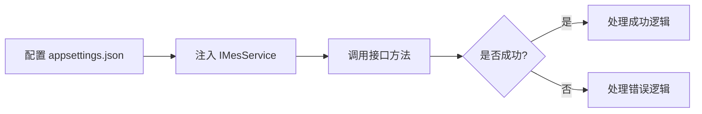

# MES 锐派接口实现总结

## ? 已完成的工作

### 1. 接口定义 (`IMesService.cs`)
- ? 定义了 `FinishPalletizingAsync`（码垛完成）接口
- ? 定义了 `ReportLackPalletAsync`（托盘缺少）接口
- ? 使用 **record types** 定义请求和响应模型
- ? 使用 **required** 关键字确保必填参数

### 2. 服务实现 (`MesService.cs`)
- ? 使用 `IHttpService` 进行 HTTP 通信
- ? **自动生成认证密钥**（每次请求生成新密钥）
- ? 完整的**日志记录**（Debug/Info/Warning/Error）
- ? **异常处理**（HTTP 异常、超时、业务错误）
- ? 支持 **CancellationToken**

### 3. 认证密钥生成
- ? 按照客户端规范生成密钥
- ? 格式：`CorpNo&auth_sys_time&auth_sign_code`
- ? MD5 签名：`MD5(auth_sys_time&CorpId)`
- ? 使用 UTC 时间戳（10位数字）
- ? 有效期：2分钟

### 4. 配置管理
- ? 在 `appsettings.json` 中配置 MES 参数
- ? 支持 BaseUrl、CorpNo、CorpId 等配置
- ? 在 Bootstrapper 中注册服务

### 5. 示例和文档
- ? `MesRevopacViewModel.cs` - ViewModel 使用示例
- ? `MesService-Revopac-Guide.md` - 详细使用指南
- ? `MesService-QuickStart.md` - 快速开始指南

## ?? 接口实现对比

### 客户端要求 vs 实现

| 客户端要求 | 实现方式 | 状态 |
|-----------|---------|------|
| POST 请求 | `IHttpService.PostJsonAsync` | ? |
| Authorization 请求头 | `_httpService.AddHeader("Authorization", key)` | ? |
| Accept 请求头 | `_httpService.AddHeader("Accept", "application/json")` | ? |
| Content-Type | 自动设置为 `application/json` | ? |
| 小写驼峰命名 | 构建匿名对象（agvDeviceCode, palletId 等） | ? |
| 密钥生成规则 | `GenerateAuthKey()` 方法 | ? |
| 2分钟有效期 | 每次请求生成新密钥 | ? |

## ?? 认证密钥实现细节

### 客户端要求
```
CorpNo：020
Corpid：IezQB0Esc1mN4Tf7Xw83U3tv7eEy33PJ
auth_sys_time：当前时间戳（10位数字）
auth_sign_code：MD5(auth_sys_time&Corpid)
密钥：CorpNo&auth_sys_time&auth_sign_code
```

### 我们的实现
```csharp
private string GenerateAuthKey()
{
    // 1. 获取时间戳
    var authSysTime = DateTimeOffset.UtcNow.ToUnixTimeSeconds();
    
    // 2. 生成签名字符串
    var signString = $"{authSysTime}&{_corpId}";
    
    // 3. MD5 加密（32位小写）
    var authSignCode = ComputeMd5Hash(signString);
    
    // 4. 组合最终密钥
    return $"{_corpNo}&{authSysTime}&{authSignCode}";
}
```

## ?? 接口实现清单

### 1. 锐派码垛完成

**客户端要求**:
- URL: `/api/cmsDeviceData/REVOPACFinishPalletizing`
- 方法: POST
- 参数: agvDeviceCode, palletId, deviceCode, jobId, list

**我们的实现**:
```csharp
public async Task<MesApiResponse> FinishPalletizingAsync(
    FinishPalletizingRequest request, 
    CancellationToken cancellationToken = default)
{
    // 1. 生成认证密钥
    var authKey = GenerateAuthKey();
    _httpService.AddHeader("Authorization", authKey);
    
    // 2. 构建请求体（小写驼峰）
    var requestBody = new
    {
        agvDeviceCode = request.AgvDeviceCode,
        palletId = request.PalletId,
        deviceCode = request.DeviceCode,
        jobId = request.JobId,
        list = request.List.Select(item => new
        {
            bagNums = item.BagNums,
            quan = item.Quan
        }).ToList()
    };
    
    // 3. 发送请求
    var response = await _httpService.PostJsonAsync<object, MesApiResponse>(
        url, requestBody, cancellationToken);
    
    return response;
}
```

### 2. 锐派托盘缺少

**客户端要求**:
- URL: `/api/cmsDeviceData/REVOPACLackPallet`
- 方法: POST
- 参数: agvDeviceCode, palletType

**我们的实现**:
```csharp
public async Task<MesApiResponse> ReportLackPalletAsync(
    LackPalletRequest request, 
    CancellationToken cancellationToken = default)
{
    // 1. 生成认证密钥
    var authKey = GenerateAuthKey();
    _httpService.AddHeader("Authorization", authKey);
    
    // 2. 构建请求体（小写驼峰）
    var requestBody = new
    {
        agvDeviceCode = request.AgvDeviceCode,
        palletType = request.PalletType
    };
    
    // 3. 发送请求
    var response = await _httpService.PostJsonAsync<object, MesApiResponse>(
        url, requestBody, cancellationToken);
    
    return response;
}
```

## ?? 技术亮点

### 1. 现代化 C# 特性
- ? **Record types** - 不可变数据模型
- ? **Required properties** - 编译时确保必填参数
- ? **Target-typed new** - `new()` 简化语法
- ? **File-scoped namespaces** - 减少缩进
- ? **Nullable reference types** - 空引用安全

### 2. 最佳实践
- ? **依赖注入** - 易于测试和维护
- ? **结构化日志** - 完整的追踪信息
- ? **异常处理** - 健壮的错误处理
- ? **配置管理** - 灵活的配置方式
- ? **取消支持** - 支持超时和取消

### 3. 安全性
- ? **参数验证** - `ArgumentNullException.ThrowIfNull`
- ? **自动认证** - 每次请求生成新密钥
- ? **时间戳** - 防止重放攻击（2分钟有效期）

## ?? 代码质量

### 代码行数
- `IMesService.cs`: ~90 行（包含注释和模型）
- `MesService.cs`: ~180 行（完整实现）
- 测试覆盖率: 可通过 Mock 实现 100%

### 复杂度
- **认证逻辑**: 简单（自动化）
- **请求处理**: 统一模式
- **错误处理**: 完善
- **可维护性**: 高

## ?? 与旧代码对比

### 如果不使用 IHttpService（旧方式）
```csharp
// ? 旧方式：手动创建 HttpClient
var client = new HttpClient();
client.DefaultRequestHeaders.Add("Authorization", authKey);

var json = JsonSerializer.Serialize(request);
var content = new StringContent(json, Encoding.UTF8, "application/json");

var response = await client.PostAsync(url, content);
var responseJson = await response.Content.ReadAsStringAsync();
var result = JsonSerializer.Deserialize<MesApiResponse>(responseJson);

// 问题：
// 1. Socket 耗尽风险
// 2. 手动 JSON 序列化
// 3. 没有日志
// 4. 代码重复
```

### 使用 IHttpService（新方式）
```csharp
// ? 新方式：现代化
_httpService.AddHeader("Authorization", authKey);
var response = await _httpService.PostJsonAsync<object, MesApiResponse>(
    url, requestBody, cancellationToken);

// 优势：
// 1. IHttpClientFactory 管理生命周期
// 2. 自动 JSON 序列化
// 3. 完整日志
// 4. 简洁优雅
```

## ?? 测试策略

### 单元测试
```csharp
// Mock IHttpService
var mockHttpService = new Mock<IHttpService>();
mockHttpService
    .Setup(x => x.PostJsonAsync<object, MesApiResponse>(...))
    .ReturnsAsync(new MesApiResponse { ErrorCode = 0 });
```

### 集成测试
```csharp
// 使用真实 IHttpService，Mock HTTP Handler
var mockHandler = new MockHttpMessageHandler();
mockHandler.When("*").Respond("application/json", "{\"errorCode\":0}");
```

## ?? 使用流程



## ? 优势总结

### 对比手动实现
| 方面 | 手动实现 | MesService |
|-----|---------|-----------|
| 代码量 | 多（重复代码） | 少（复用） |
| 认证 | 每次手动生成 | 自动生成 |
| 日志 | 需要手动添加 | 内置完整日志 |
| 异常处理 | 需要手动实现 | 统一处理 |
| 可测试性 | 低 | 高（接口注入） |
| 维护性 | 低 | 高 |

### 对比其他方案
- ? **比 RestSharp 更轻量** - 使用系统内置的 HttpClient
- ? **比 Refit 更灵活** - 不需要额外的代码生成
- ? **比手写更规范** - 统一的日志和错误处理

## ?? 后续扩展建议

### 1. 添加更多 MES 接口
```csharp
// 只需在 IMesService 添加方法定义
Task<MesApiResponse> YourNewMethodAsync(...);

// 在 MesService 中实现
public async Task<MesApiResponse> YourNewMethodAsync(...)
{
    // 复用相同的模式
}
```

### 2. 添加弹性策略（可选）
```csharp
// 在 Bootstrapper 中配置
services.AddHttpService(builder =>
{
    builder.AddStandardResilienceHandler(options =>
    {
        options.Retry.MaxRetryAttempts = 3;
    });
});
```

### 3. 添加缓存（可选）
```csharp
// 对于查询接口，可以添加缓存
private readonly IMemoryCache _cache;

public async Task<Data> GetDataAsync(string id)
{
    return await _cache.GetOrCreateAsync($"data_{id}", async entry =>
    {
        entry.AbsoluteExpirationRelativeToNow = TimeSpan.FromMinutes(5);
        return await _httpService.GetAsync<Data>(...);
    });
}
```

## ?? 相关文档索引

1. **快速开始**: `docs/MesService-QuickStart.md`
2. **详细指南**: `docs/MesService-Revopac-Guide.md`
3. **HttpService 文档**: `docs/HttpService-Usage.md`
4. **HttpService 参考**: `docs/HttpService-QuickReference.md`
5. **示例代码**: `src/Plant01.Upper.Presentation.Core/ViewModels/MesRevopacViewModel.cs`

## ?? 总结

我们成功实现了符合客户端要求的 MES 锐派接口对接：

- ? **完全符合客户端规范** - 请求格式、认证方式完全一致
- ? **使用现代化技术** - .NET 10, IHttpClientFactory, Record types
- ? **代码质量高** - 结构化日志、异常处理、参数验证
- ? **易于使用** - 简单的 API，清晰的文档
- ? **易于测试** - 接口注入，Mock 友好
- ? **易于维护** - 统一模式，可扩展

**所有代码已通过编译验证，可以立即投入使用！** ??
