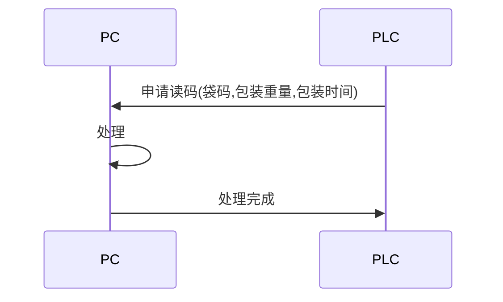
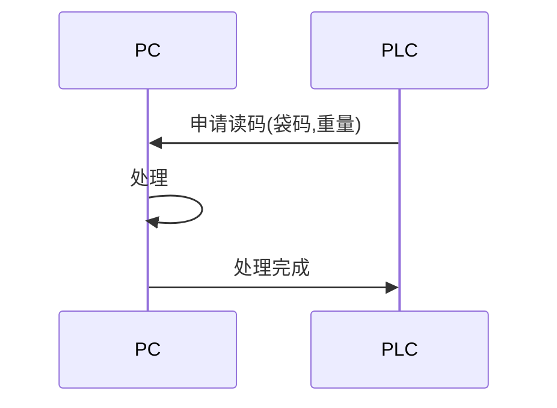
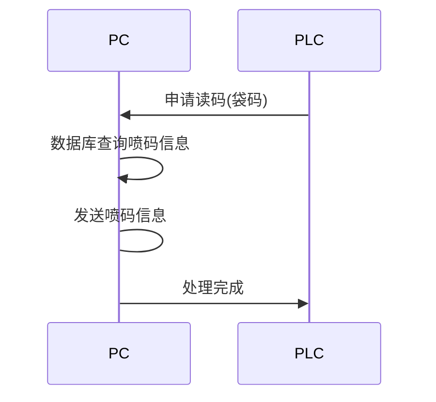
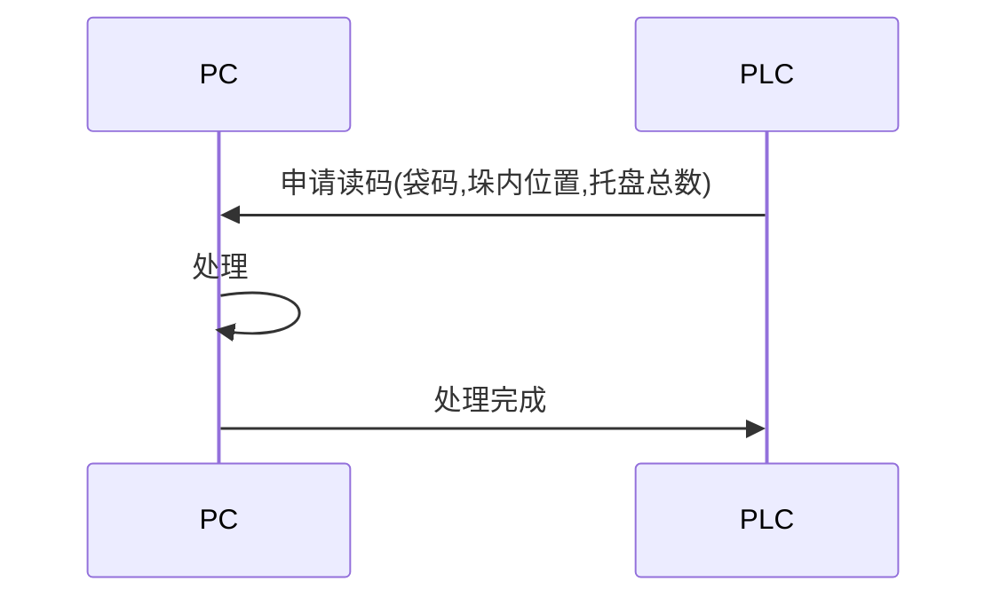
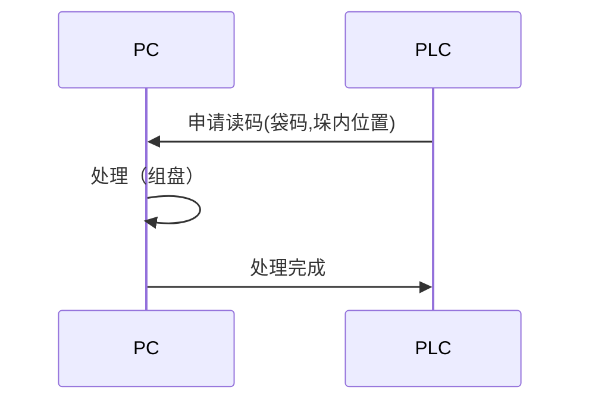
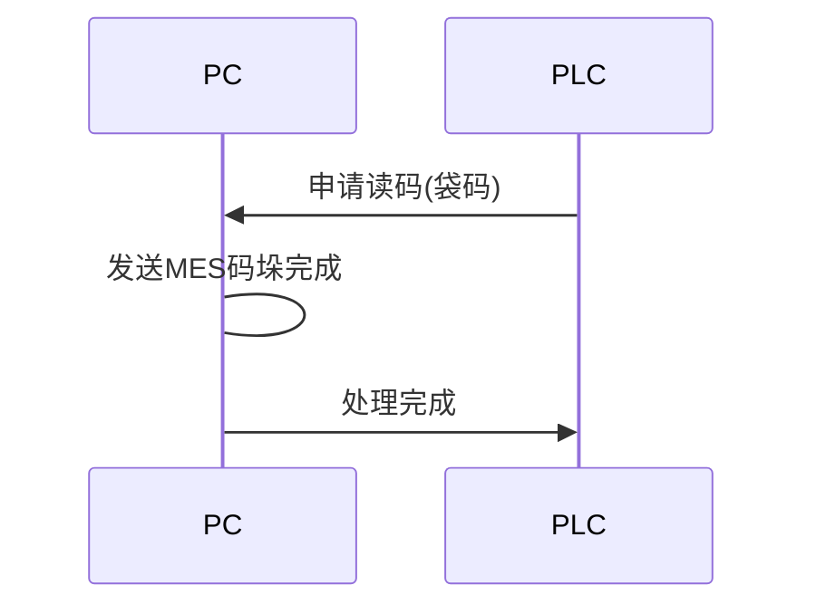
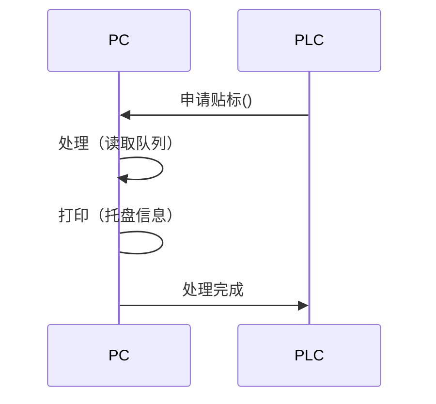

#### 包装工位时序图

```mermaid
sequenceDiagram
   participant A as PC
   participant B AS PLC
   B ->> A : 申请读码(袋码,包装重量,包装时间)
   A ->> A : 处理
   A ->> B : 处理完成
```

#### 复检称重工位时序图

```mermaid
sequenceDiagram
   participant A as PC
   participant B AS PLC
   B ->> A : 申请读码(袋码,重量)
   A ->> A : 处理
   A ->> B : 处理完成
```

#### 喷码工位时序图

```mermaid
sequenceDiagram
   participant A as PC
   participant B AS PLC
   B ->> A : 申请读码(袋码)
   A ->> A : 数据库查询喷码信息
   A -> A : 发送喷码信息
   A ->> B : 处理完成
```

#### 码垛工位时序图

```mermaid
sequenceDiagram
   participant A as PC
   participant B AS PLC
   B ->> A : 申请读码(袋码,垛内位置,托盘总数)
   A ->> A : 处理
   A ->> B : 处理完成
```

#### 组盘工位时序图

```mermaid
sequenceDiagram
   participant A as PC
   participant B AS PLC
   B ->> A : 申请读码(袋码,垛内位置)
   A ->> A : 处理（组盘）
   A ->> B : 处理完成
```

#### 覆膜缠绕工位时序图

```mermaid
sequenceDiagram
   participant A as PC
   participant B AS PLC
   B ->> A : 申请读码(袋码)
   A -> A : 发送MES码垛完成
   A ->> B : 处理完成
```

#### 贴标工位时序图

```mermaid
sequenceDiagram
   participant A as PC
   participant B AS PLC
   B ->> A : 申请贴标()
   A ->> A : 处理（读取队列）
   A -> A : 打印（托盘信息）
   A ->> B : 处理完成
```

#### 进托盘工位时序图

```mermaid
sequenceDiagram
   participant A as PC
   participant B AS PLC
   B ->> A : 缺少托盘(母托盘/子托盘)
   A ->> A : 发送给MES
   A ->> B : 处理完成
```

